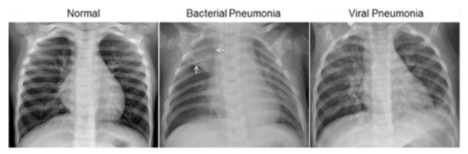

# Pneumonia_detection_cnn

This project is a final group project of Lambton College (Mississauga): Semester - 3.

## Memebers List:
- Rahul Rawat
- Ronakkumar Chavda
- Sehaj Singh Jaggi
- Shruthi

## Dataset:
For this project we have choose, Chest X-Ray Images (Pneumonia) data from the Kaggle.



The dataset is organized into 3 folders (train, test, val) and contains subfolders for each image category (Pneumonia/Normal). There are 5,863 X-Ray images (JPEG) and 2 categories (Pneumonia/Normal).

The normal chest X-ray (left panel) depicts clear lungs without any areas of abnormal opacification in the image. Bacterial pneumonia (middle) typically exhibits a focal lobar consolidation, in this case in the right upper lobe (white arrows), whereas viral pneumonia (right) manifests with a more diffuse "interstitial" pattern in both lungs.

## Installation:

### Step - 1:
Clone the repository on your machine and open the folder in VScode.
```bash
git clone https://github.com/RawatRahul14/Pneumonia_detection_cnn.git

cd Pneumonia_detection_cnn

code .
```

### Step - 2:
Create the virtual environment and activate it.
```bash
python -m venv .venv
.venv/Scripts/activate
```

### Step - 3:
Install the required packages.
```bash
pip install -r requirements.txt
```

### Step - 4:
First, run the main.py file to run the file.
```bash
python main.py
```

### Step - 5:
Now, to run the streamlit UI, run the below code.
```bash
streamlit run app.py
```